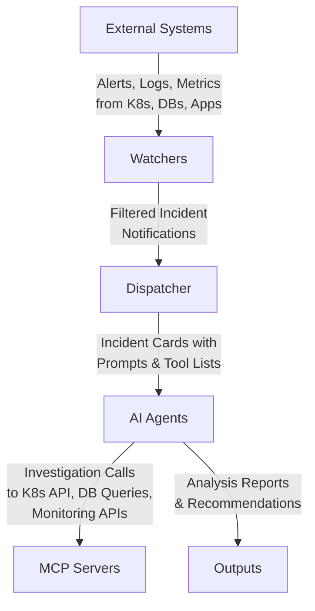

# MCP Sentinel

**Intelligent incident response powered by AI agents**

MCP Sentinel automates incident response by monitoring alerts and dispatching AI agents to investigate and resolve issues automatically.

## Purpose

When alerts fire at 3 AM, operators face the challenge of quickly understanding complex system failures while under pressure. MCP Sentinel aims to dramatically reduce the time between alert and actionable insights by providing what every operator needs: **a senior SRE sitting next to you during incidents**.

Instead of manually gathering logs, checking metrics, and correlating data across multiple systems, MCP Sentinel's AI agents do the investigative work instantly. They know which tools to use, what questions to ask, and how to synthesize findings into clear, actionable recommendations.

**Key Benefits:**
- **Faster Mean Time to Understanding**: Reduce context-gathering from hours to minutes
- **Consistent Investigation Quality**: Every incident gets the same thorough analysis
- **Knowledge Democratization**: Junior operators get senior-level insights immediately
- **24/7 Availability**: Expert-level investigation at any time, without human fatigue

## Architecture

## How It Works

1. **External Systems**: Generate alerts and logs from your infrastructure
2. **Watchers**: Monitor and filter alerts from Prometheus, Grafana, and other sources
3. **Dispatcher**: Queue and route incidents to appropriate AI agents
4. **AI Agents**: Investigate using MCP servers to access external tools
5. **Outputs**: Send analysis and recommendations to Slack, Jira, and other destinations

## Getting Started

**Tutorials:**
- [Getting Started Guide](docs/tutorial/getting-started.md) - Complete hands-on tutorial
- [Ceph OSD Troubleshooting](docs/tutorial/ceph-osd-troubleshooting.md) - Real-world example using Juju and Ceph

## License

Licensed under the Apache License, Version 2.0. See [LICENSE](LICENSE) for the full license text.
